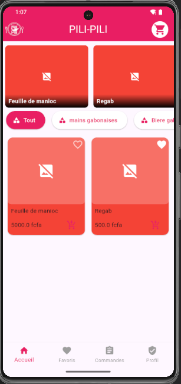
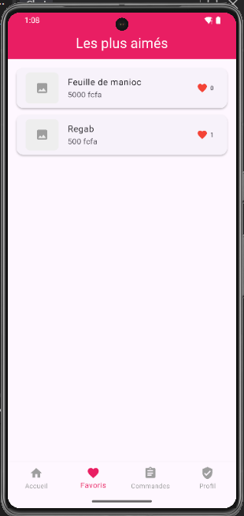
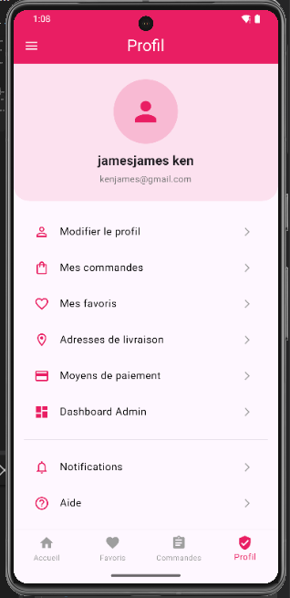
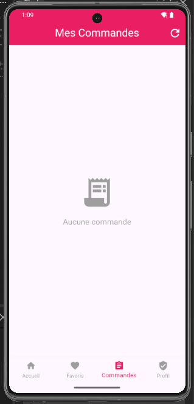
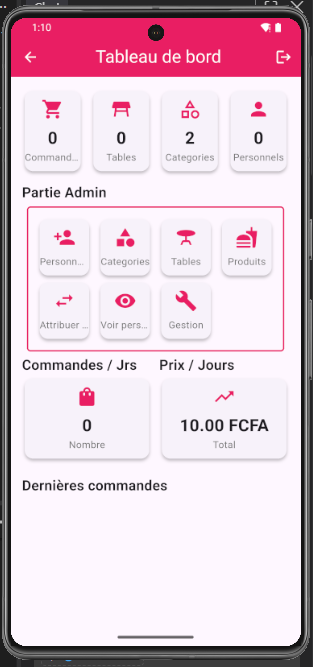
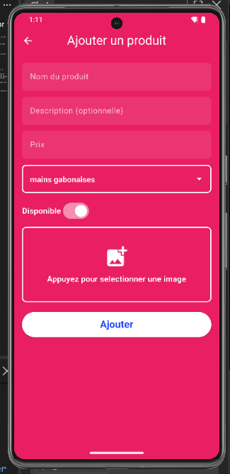
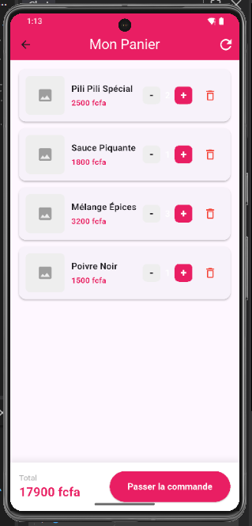

ICI EST LE README.MD DE MON APPLICATION PILI-PILI
1. OBJECTIF
    PILI-PILI  est une application de reservation de nourriture,elle permet a lutilisateur de commander de la nourriture, de se faire livrer sur place ou sil une table sil est au dite restaurant. elle vise a pallier le probleme d'attente.
2. FONCTIONNALITE PRINCIPALE
    COTE  UTILISATEUR
    Commander des plats;
    Réserver une table au restaurant;
    Ajouter des produits en favoris;
    Gérer son profil et son historique de commandes.
    COTE ADMIN
    Ajouter, modifier ou supprimer :
        Produits
        Catégories
        Tables
        Travailleurs (cuisiniers, serveurs, livreurs)
        Assigner les tables aux serveurs.
    Consulter :
        Les recettes journalières
        Les commandes par jour
        La liste des utilisateurs

3. TECHNOLOGIE ET PACKAGE UTILISES
    pili-pili a ete developper en flutter utilisant la base des donnees sqlite, qui est une base des donnees document.
    les packages utilises sont:
        flutter_svg: ^2.3.0
        path: ^1.9.1
        sqflite: ^2.4.3
        flutter_secure_storage: ^10.3.1
        image_picker: ^1.2.3
        uuid: ^4.6.0
        provider: ^6.1.5+1
        path_provider
4. INSTALLATION
    pour installer l'application, il faut dabord cloner le depot, se mettre sous la racine du projet et de lancer la commande: flutter run

5. LANCEMENT DE L'APPLICATION
    comme l'application utilise une base des donnees locale, il va fallaoir aller sur l'onglet "profil", il faut creer un compte et se connecter en suite reenir sur la page "profil" ou jai laisser un onglet "Dashboard admin" qui vous permettra de tester l'application, inserer les produits, utilisateurs, categories, tables,... afin de manipuler et gerer l'application,
    
6. TESTS REALISES
    pour la bonne coordination et de bonne marche de l'application, differents tests ont ete realises sur l'application qui sont entre autre:
    - test unitaire;
    - test des widgets;
    - test d'integration
7. CAPTURES D'ECRAN
 pour presenter un appercus globale de mon application, les differents captures decran ci dessous ont ete realisees apres avoir inserer quelques produits et categories
 PAGE ACCEUIL
  
 PAGE FAVORIS
 
 PAGE PROFIL
 
 PAGE COMMANDE
 
 PAGE ADMIN
 
 PAGE AJOUT PRODUIT
 
 PAGE PANIER
 
 comme c'est un appercu, je ne pouvais pas mettres tous les pages, sinon l'application a plus de 20 pages

8. difficultes rencontres
    les difficultes rencontres sont d'ordres techniques comme le test dintegration qui, le package officiel est revolu et ca aussi causer de retard dans la livraison du projet.
    en plus, je me trouve dans une zone ou les coupures d'electricite est repetivites et vu le delais de livraison cela empeche de bien approfondire les concepts et d'innover.

9. AUTEUR 
    MOUKTAR MATNA